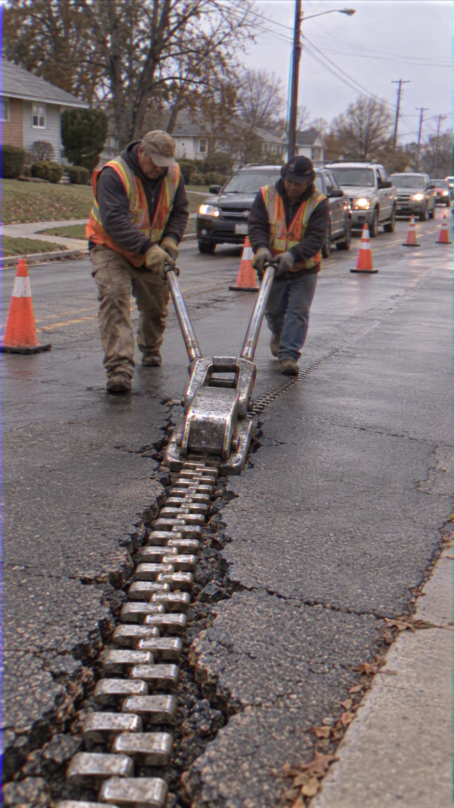
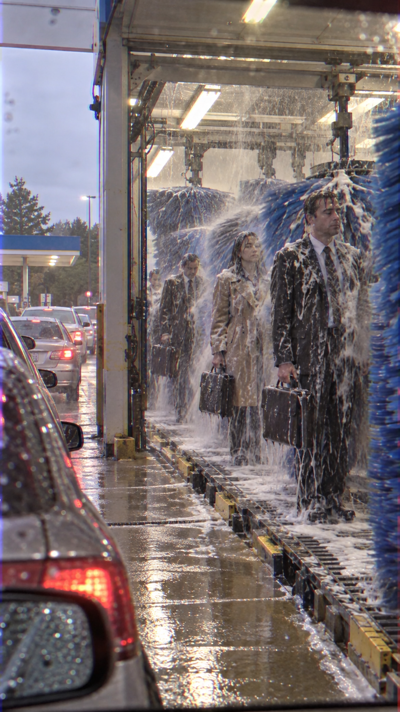
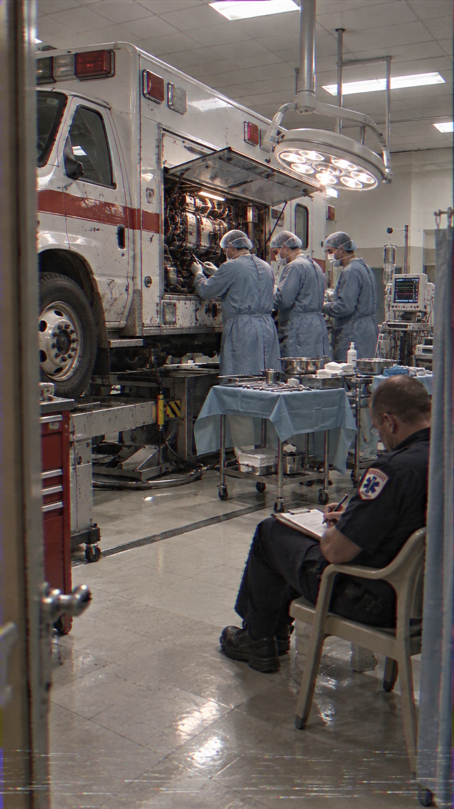
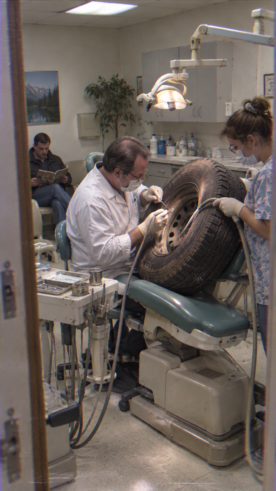

# Deadpan Camcorder Surrealism / 冷面DV超现实

一个用于生成“像被普通人偶然拍到”的超现实照片的 Codex Skill。它把乏味、可信的日常空间与一个清晰的物理悖论放在同一画面里，并用可验证的接触、重量、痕迹和环境反馈，让荒诞事件看起来像真实记录。

v0.2 将消费级摄像机质感拆分为 VHS-C、Hi8、Digital8 与 MiniDV 四套一致的采集语言，不再依靠笼统的“复古 VHS 滤镜”。

## 最简用法

```text
使用 $deadpan-camcorder-surrealism 生成：场景 + 一个反常识事件。
```

例如：

```text
使用 $deadpan-camcorder-surrealism 生成：市政工人用一条巨型拉链修补开裂的马路。
```

没有指定数量时，Skill 会先构思三个文字方案，按可读性、物理证据、环境反馈、偶然取景可信度和年代一致性进行筛选，再生成一张图片。也可以明确指定数量、画幅、摄像格式、年代或仅要求提示词。

## v0.2 特点

- 一个异常事件，其他物理规则保持正常。
- 用承重、接触、投影、反射、位移、磨损与环境应对证明异常物真实占据空间。
- 为镜头指定合理的目击者、拍摄位置和“发现得太晚”的构图失误。
- 分别建模 VHS-C、Hi8、Digital8 与 MiniDV，避免混合所有录像缺陷。
- 检查车辆、手机、显示器、支付终端、包装、服装、室内设计与所选年代是否一致。
- 使用五项 evidence test 判断接触、后果、环境适应、单一例外与相机因果关系。
- 只针对失败维度修正，保留已经成立的概念、构图和证据。
- 参考图只用于提炼视觉语言，不复刻人物、地点、动作或标志性画面。

## 摄像格式

| 格式 | 推荐年代 | 核心特征 |
|---|---|---|
| VHS-C | 1990 年代早期 | 最柔软的细节、不稳定色度、横向噪声与轻微底部磁头切换干扰 |
| Hi8 | 1990 年代后期 | 柔和模拟亮度、较强色彩、轻微色度爬行与边缘拖影 |
| Digital8 | 1999–2005 | 隔行数字边缘、轻微锐化振铃与克制的块状破损 |
| MiniDV | 1999–2006 | 较干净的消费级视频、冷绿自动白平衡、亮部截断与轻微 DV 压缩痕迹 |

## 示例

### 用拉链修马路



### 自动洗车机清洗上班族



### 医生给救护车做手术



### 牙医给汽车轮胎看牙



## 安装

将本仓库克隆或解压到 Codex skills 目录，使结构如下：

```text
skills/
└── deadpan-camcorder-surrealism/
    ├── SKILL.md
    ├── VERSION
    ├── CHANGELOG.md
    ├── agents/
    └── references/
```

随后在对话中使用 `$deadpan-camcorder-surrealism` 调用。图片生成依赖 Codex 内置 `image_gen`。

## 当前版本

`v0.2.0`：增加 evidence-first 场景构造、环境反馈、偶然相机逻辑、四类摄像格式、年代一致性检查和定向修正模式。详见 [CHANGELOG.md](CHANGELOG.md)。

## License

[MIT](LICENSE)
